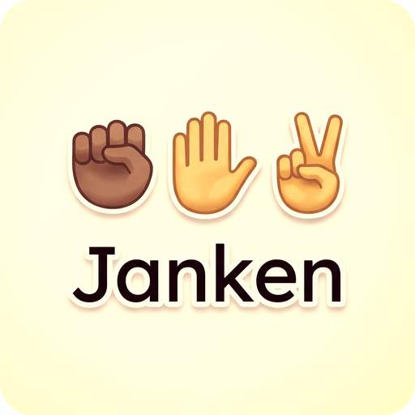
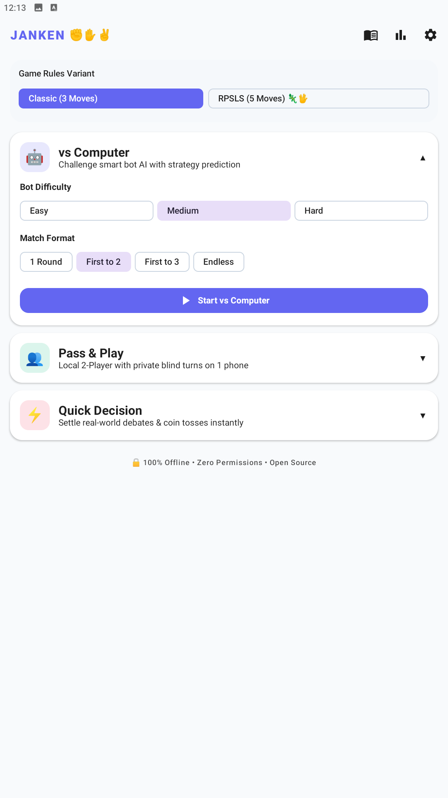
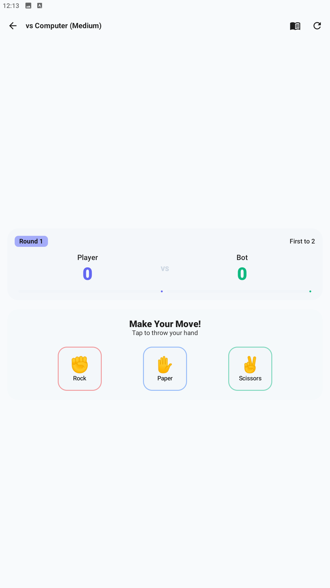
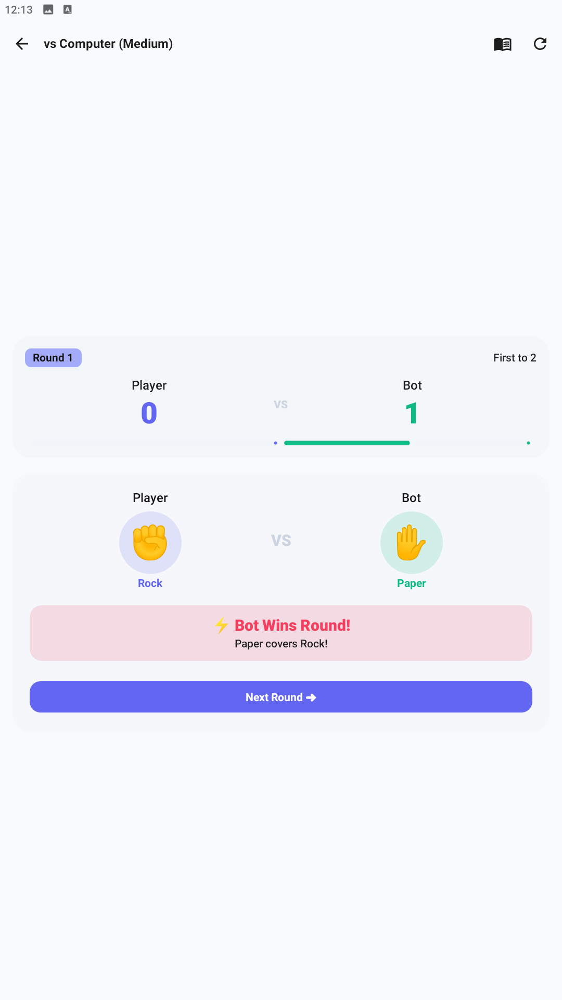
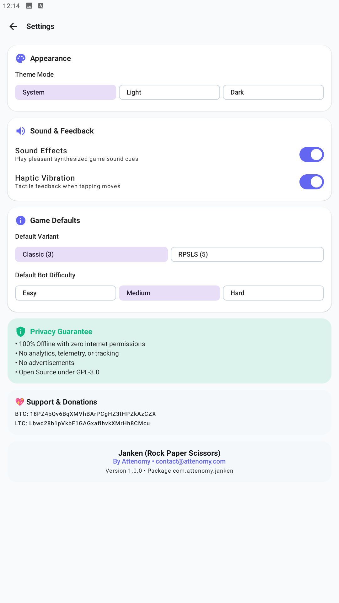
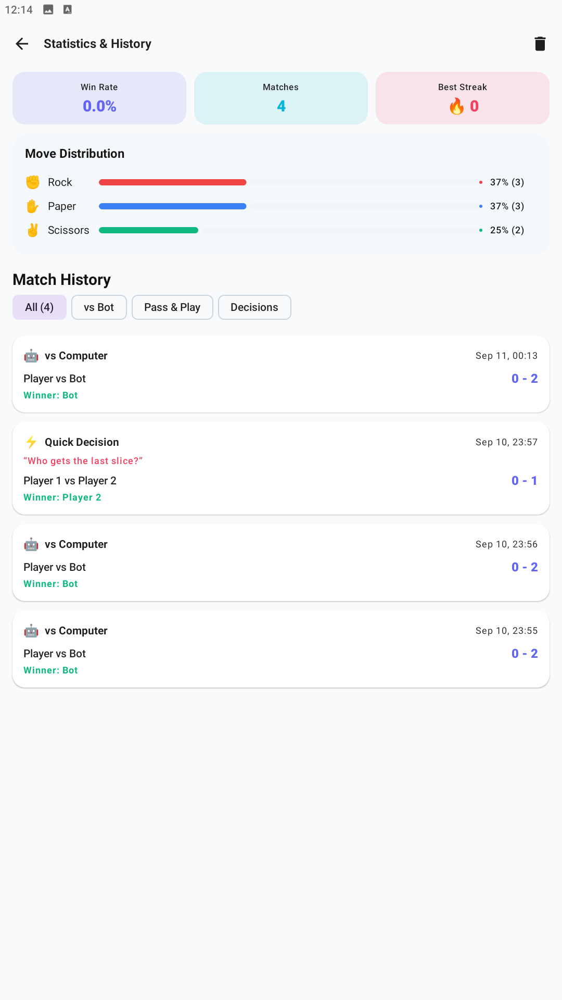
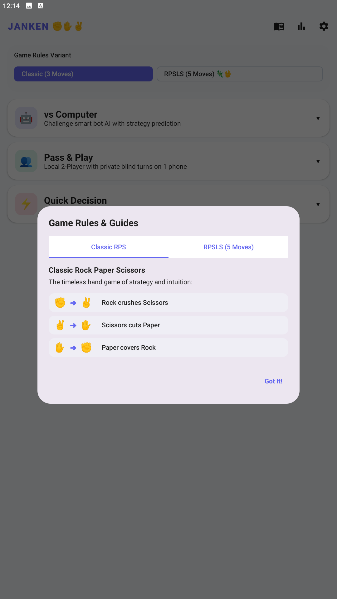

# Janken (Rock • Paper • Scissors) ✊✋✌️

[](LICENSE)
[](https://android.com)
[](https://developer.android.com/jetpack/compose)
[](https://kotlinlang.org)
[](#privacy--f-droid-philosophy)

<p align="center">
  
</p>

**Janken** is a modern, privacy-first, fully offline Rock-Paper-Scissors and RPSLS game for Android, crafted with **Jetpack Compose** and **Material 3**.

Designed as a premier F-Droid native utility and game, Janken features a true **local Pass & Play** mode with a privacy screen lock, adaptive **Bot AI** powered by Markov Chain pattern analysis, a **Quick Decision** showdown tool, and full **lifetime statistics**.

---

## ✨ Features

### 1. 👥 Pass & Play (Local 2-Player on 1 Phone)
* **Private Blind Choice**: Player 1 secretly selects their move.
* **Privacy Shield**: The choice is immediately locked and concealed behind a privacy barrier before handing the device to Player 2.
* **Dramatic Dual Reveal**: Once Player 2 confirms their turn, the app reveals both moves with vibrant celebration animations and winner announcements.

### 2. 🤖 vs Computer (Smart Bot AI)
* **3 Difficulty Modes**:
  * **Easy**: Classic randomized selection.
  * **Medium**: Reactive counter-strategy.
  * **Hard**: Adaptive **Markov Chain** AI that tracks your move patterns and psychological tendencies (*Win-Stay, Lose-Shift*) to anticipate your next move.
* **Match Formats**: Best of 1, Best of 3, Best of 5, First to X, or Endless Free Play.

### 3. ⚡ Quick Decision Maker
* Turn everyday debates into swift, fun showdowns:
  * *"Who gets the last slice of pizza?"*
  * *"Who pays for coffee?"*
  * *"Who takes out the trash?"*
  * *"Who picks the movie tonight?"*
  * Or type any custom question!

### 4. 🦎 Rock • Paper • Scissors • Lizard • Spock (RPSLS)
* Toggle the classic 5-move extended game mode (created by Sam Kass and Karen Bryla, popularized by *The Big Bang Theory*).
* Interactive in-app visual rules dialog explaining all 10 victory paths.

### 5. 📊 In-Depth Statistics & Match History
* Track lifetime win rates, total rounds played, current winning streaks, and all-time best streaks.
* Visual move distribution breakdown (Rock %, Paper %, Scissors %, Lizard %, Spock %).
* Offline match history log with round-by-round details.

### 6. 🎨 Premium Modern Polish
* **Neutral Dark Grey Theme** with crisp white status bars and clean Material 3 contrast.
* **Centered Portrait Gameplay UI** for maximum comfort and aesthetics.
* **Haptic Feedback** and tactile vibration responses.
* **Synthesized Audio**: Pleasant offline sound chimes and audio cues generated directly with PCM audio.
* **Celebratory Confetti** canvas particles on match victory.

---

## 🔒 Privacy & F-Droid Philosophy

* **100% Offline**: Requires zero internet permissions (`android.permission.INTERNET` is completely omitted from the manifest).
* **Zero Telemetry**: No analytics, trackers, or third-party advertising SDKs.
* **No Accounts**: No sign-in or data collection of any kind.
* **Open Source**: Licensed under GPLv3.

---

## 📱 Screenshots

| Home Screen | vs Computer (Bot) | Pass & Play Shield |
|:---:|:---:|:---:|
|  |  |  |

| Quick Decision | Statistics & Streaks | Settings & Theme |
|:---:|:---:|:---:|
|  |  |  |

---

## 🛠️ Building From Source

### Prerequisites
* JDK 17+
* Android SDK (API 35)

### Build Steps

```bash
# Clone the repository
git clone https://github.com/attenomy/janken.git
cd janken/android

# Run unit tests
./gradlew test

# Build Debug APK
./gradlew assembleDebug

# Build Release APK
./gradlew assembleRelease
```

The compiled APK will be available in `android/app/build/outputs/apk/`.

---

## 📜 Game Rules Summary

### Classic RPS (3 Moves)
* ✊ **Rock** crushes ✌️ **Scissors**
* ✌️ **Scissors** cuts ✋ **Paper**
* ✋ **Paper** covers ✊ **Rock**

### RPSLS (5 Moves)
* ✌️ **Scissors** cuts ✋ **Paper**
* ✋ **Paper** covers ✊ **Rock**
* ✊ **Rock** crushes 🦎 **Lizard**
* 🦎 **Lizard** poisons 🖖 **Spock**
* 🖖 **Spock** smashes ✌️ **Scissors**
* ✌️ **Scissors** decapitates 🦎 **Lizard**
* 🦎 **Lizard** eats ✋ **Paper**
* ✋ **Paper** disproves 🖖 **Spock**
* 🖖 **Spock** vaporizes ✊ **Rock**
* ✊ **Rock** crushes ✌️ **Scissors**

---

## 💖 Support & Donations

If you enjoy using Janken and want to support its continued development, donations are gratefully accepted:

* **Bitcoin (BTC)**: `18PZ4bQv6BqXMVhBArPCgHZ3tHPZkAzCZX`
* **Litecoin (LTC)**: `Lbwd28b1pVkbF1GAGxafihvkXMrHh8CMcu`

---

## 👤 Author & Contact

* **Author**: Attenomy
* **Email**: [contact@attenomy.com](mailto:contact@attenomy.com)
* **GitHub**: [@attenomy](https://github.com/attenomy)

---

## 📄 License

This project is licensed under the **GNU General Public License v3.0** - see the [LICENSE](LICENSE) file for details.